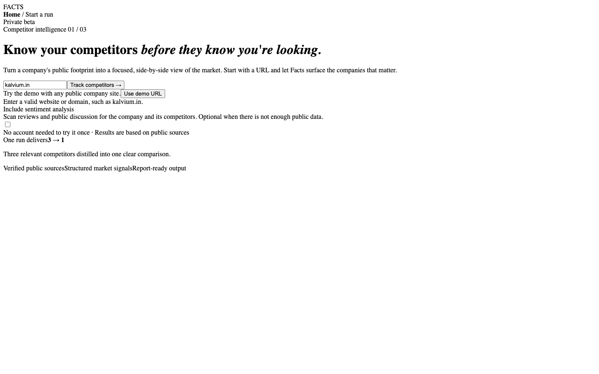
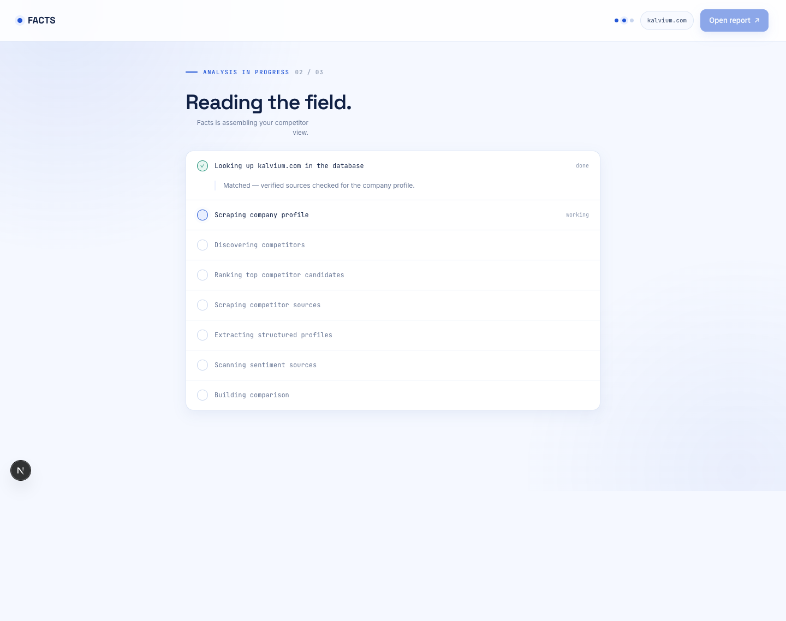
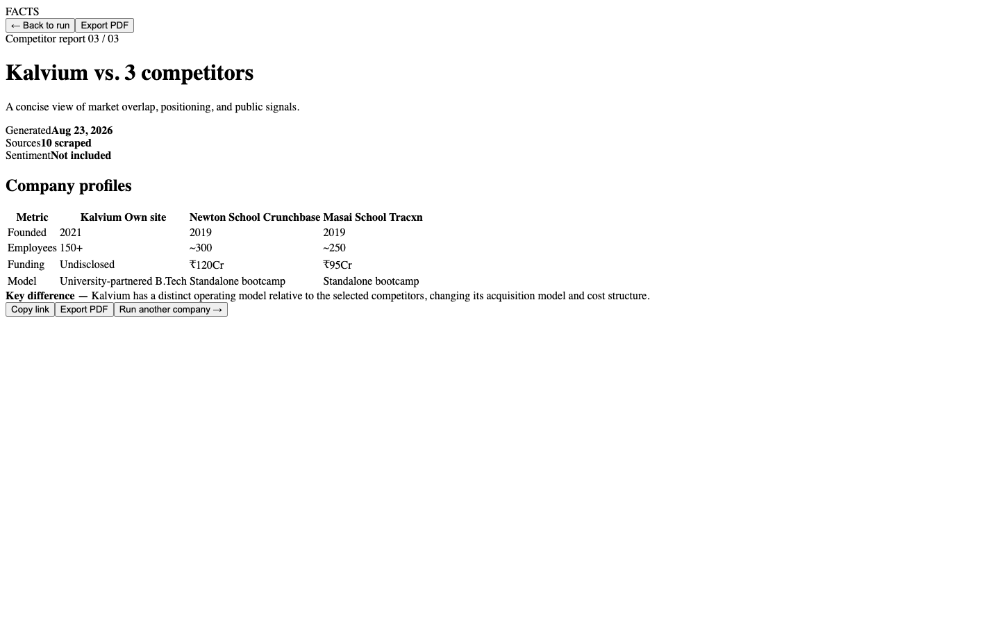

# Facts

Facts is a Next.js full-stack web application for automated competitor discovery, comparison, and market research from a single company URL. Tagline: **AI-powered competitor intelligence, grounded in real data**.

## Architecture overview

Facts uses a fixed-sequence pipeline, not an autonomous agent. Each stage takes a defined input, returns structured JSON, and writes to a shared `PipelineState`. This keeps behavior deterministic, controls external API cost, and makes failures easier to reason about.

```text
1. Ingest User Company
   URL -> Bright Data scrape -> rawContent
        |
2. Understand Company
   rawContent -> LLM JSON -> CompanyProfile
        |
3. Discover Competitors
   searchIntentPhrase -> LLM-native candidates + Tavily enrichment -> raw candidates
        |
4. Rank & Select Competitors
   raw candidates + CompanyProfile -> LLM ranking -> top 5 competitors
        |
5. Scrape Competitors
   competitor domains -> Bright Data fan-out -> source content per competitor
        |
6. Extract Structured Data
   scraped source content -> LLM JSON -> competitor CompanyProfile[]
        |
7. Comparison
   user CompanyProfile + competitors -> LLM JSON -> ComparisonResult
        |
8. Sentiment Optional
   company names/domains -> Tavily review search + LLM scoring -> SentimentResult[]
```

## Folder structure

```text
facts/
├── app/                            # Next.js App Router pages and API routes
│   ├── page.tsx                    # Input form and pipeline progress screen
│   ├── results/
│   │   └── page.tsx                # Results dashboard
│   ├── api/
│   │   └── analyze/
│   │       └── route.ts            # Main orchestrating endpoint
│   └── layout.tsx                  # Root layout and metadata
├── lib/                            # Shared backend services and types
│   ├── pipeline/                   # One pure pipeline function per stage
│   ├── clients/                    # Bright Data, Tavily, and LLM wrappers
│   └── types.ts                    # Shared TypeScript schemas
├── components/                     # Dashboard cards, charts, progress, and tables
├── public/
│   └── screenshots/                # Placeholder screenshot assets
├── .env.example                    # Required environment variables
└── README.md                       # Project documentation
```

## Setup instructions

Create a `.env.local` file using `.env.example` as the template:

```bash
TAVILY_API_KEY=
BRIGHT_DATA_API_TOKEN=
BRIGHT_DATA_WEB_UNLOCKER_ZONE=web_unlocker1
BRIGHT_DATA_COLLECTOR_COMPANY_SITE=
BRIGHT_DATA_COLLECTOR_CRUNCHBASE=gd_l1vijqt9jfj7olije
BRIGHT_DATA_COLLECTOR_LINKEDIN=gd_l1vikfnt1wgvvqz95w
BRIGHT_DATA_COLLECTOR_TOFLER=
OLLAMA_BASE_URL=http://localhost:11434
LLM_MODEL=llama3.2:latest
```

Local LLM prerequisites:

- Install Ollama and keep it running locally with `ollama serve` on the default port `11434`.
- Pull the default model with `ollama pull llama3.2:latest`.
- Override `LLM_MODEL` in `.env.local` if you prefer another local tag.

Then install dependencies and run the app:

```bash
npm install
npm run dev
```

The LLM pipeline uses LangChain with a local Ollama/Qwen model. Bright Data needs an API token plus a Web Unlocker zone (homepages) and/or dataset IDs (Crunchbase, LinkedIn).

## Setting up Bright Data

Facts uses three Bright Data products, routed by ID prefix:

| Source | Env var | Default | API |
| --- | --- | --- | --- |
| Company homepages | `BRIGHT_DATA_WEB_UNLOCKER_ZONE` | your Unlocker zone name | `POST /request` (markdown) |
| Company homepages (optional) | `BRIGHT_DATA_COLLECTOR_COMPANY_SITE` | empty | `gd_…` Datasets v3 or `c_…` Scraper Studio |
| Crunchbase | `BRIGHT_DATA_COLLECTOR_CRUNCHBASE` | `gd_l1vijqt9jfj7olije` | Datasets v3 |
| LinkedIn companies | `BRIGHT_DATA_COLLECTOR_LINKEDIN` | `gd_l1vikfnt1wgvvqz95w` | Datasets v3 |
| Tofler (optional) | `BRIGHT_DATA_COLLECTOR_TOFLER` | empty | Datasets v3 or collector |

1. Create an API key under [account users](https://brightdata.com/cp/setting/users) and set `BRIGHT_DATA_API_TOKEN`.
2. Create a [Web Unlocker](https://brightdata.com/cp/web_access) zone. Copy the **zone name** from the Overview tab into `BRIGHT_DATA_WEB_UNLOCKER_ZONE`, or leave it blank and Facts will use the first active `unblocker` zone on the account.
3. Leave the Crunchbase and LinkedIn dataset IDs as the published library scrapers, or replace them with your own `c_…` Scraper Studio collectors.
4. Leave `BRIGHT_DATA_COLLECTOR_TOFLER` empty unless you need India filings.

Do not put placeholder `c_xxxxxxxxxxxxxxxx` values in `.env.local`. Next.js loads `.env.local` over `.env`, so placeholders hide real IDs.

`gd_…` IDs call `POST /datasets/v3/scrape`. If Bright Data returns HTTP 202, the client polls `/datasets/v3/progress/{snapshot_id}` and downloads `/datasets/v3/snapshot/{snapshot_id}`. `c_…` IDs use `/dca/trigger` and `/dca/dataset`. The client never sends a collector ID to the Datasets API.

Stage 5 looks up canonical Crunchbase/LinkedIn URLs with Tavily when a key is set, then batches those URLs (up to 20) in one dataset request. Homepages go through Web Unlocker with a concurrency limit of 3.

Before running the full pipeline, test homepage scraping:

```bash
npm run test:brightdata
```

This hits Kalvium by default (`BRIGHT_DATA_TEST_URL` to override), prints the markdown or JSON, and checks that Stage 2 can use it as `rawContent`.

A Cursor MCP SSE URL (`.cursor/mcp.json`, gitignored) is only for the IDE agent. The Facts pipeline does not call MCP.

## Pipeline stage reference

| Stage | Input | Output | External service |
| --- | --- | --- | --- |
| 1. Ingest User Company | Company URL | `rawContent: string` | Bright Data Web Unlocker |
| 2. Understand Company | `rawContent` | `CompanyProfile` | LLM |
| 3. Discover Competitors | `searchIntentPhrase` | `{ name, domain? }[]` | LLM + Tavily |
| 4. Rank & Select Competitors | Raw candidates + `CompanyProfile` | `Competitor[]` max 5 | LLM |
| 5. Scrape Competitors | Competitor domains | Raw content per competitor/source | Unlocker + Datasets v3 |
| 6. Extract Structured Data | Competitor source content | `CompanyProfile[]` | LLM |
| 7. Comparison | User profile + competitor profiles | `ComparisonResult` | LLM |
| 8. Sentiment Optional | Company name + domain | `SentimentResult[]` | Tavily + LLM |

## Screenshots






## Known limitations

Financial and revenue data is often unavailable for smaller private companies, especially when public MCA-style filings or funding databases do not expose usable details. Sentiment analysis is optional and depends on public review source availability; when evidence is sparse, Facts returns an explicit insufficient-data state rather than forcing a score.
